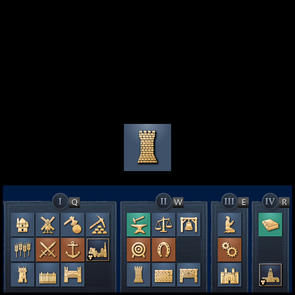

# AMAVillager

Train your villager shortcuts !

Made with [Bevy](https://github.com/bevyengine/bevy).

## How to Run
1. Install Rust and Cargo : [instructions](https://doc.rust-lang.org/cargo/getting-started/installation.html)
2. clone the repository : `git clone https://github.com/aktaboot/AMAVillager.git` or download the repositiory [zip](https://github.com/aktaboot/AMAVillager/archive/refs/heads/main.zip)
3. Move to the downloaded directory
4. run `cargo run` in the Terminal

### Troubleshoot

If getting `tracing` erros when building

`cargo update -p tracing-wasm --precise 0.2.0`

## Roadmap

### Functionalities
* [ ] Add a Menu Page -> Check Bevy stages
    * [ ] Add Setting without Panel
* [ ] Add Other Civs
* [ ]  Add Score

